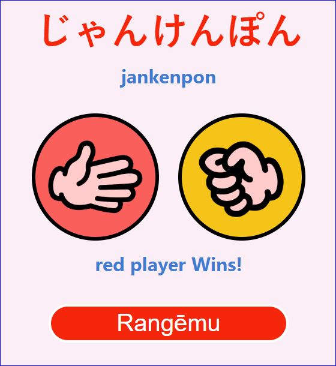

# JanKenPon

 Rock Paper Scissor game made with react.js

# WIP
- [x] User buttons
- [ ] Button's feedback
- [ ] User/machine name
- [ ] Round and wins/lose counter
- [ ] Style de winning text
- [ ] Select between PvCPU - CPUvsCPU
- [ ] Integrate with socket.io for multiplayer option

  
