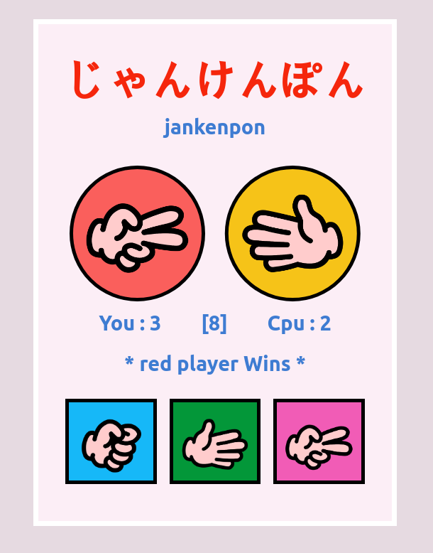

# JanKenPon

 Rock Paper Scissor game made with react.js

# WIP
- [x] User buttons
- [x] User/machine name
- [x] Round and wins/lose counter
- [x] Style de winning text
- [x] Reset button
- [ ] Button's feedback
- [x] Make it Responsive 
- [ ] Select between PvCPU - CPUvsCPU
- [ ] Integrate with socket.io for multiplayer option

  
